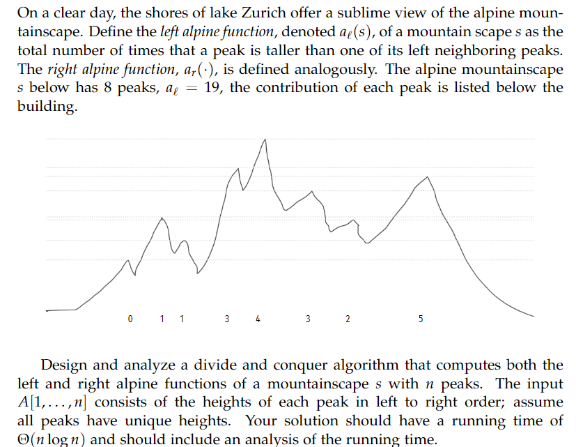

# peaks

## Question

## Explanation
The algorithm here is a slight tweak of the Merge Sort algorithm. The merge function has been changed to include a hashmap, to increment a counter for when element in right subarray is added to the merged array, then increment the count of that element in the hashmap by index 'i' which corresponds to index of left subarray. That way, the hashmap would give us the count of number of higher peaks to the left of every element. Applying this process again to the reversed array would fetch us the count of number of higher peaks to the right of every element. Summing up all these counts will give us the total sum of the alpine function.

## Runtime
O($n log n$)
