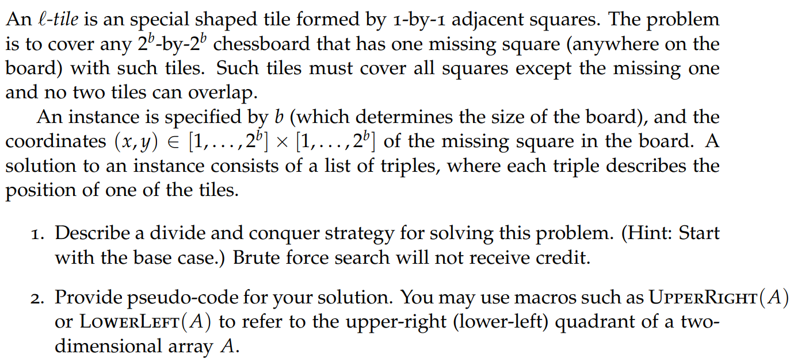

# tromino-tiling

## Question

## Explanation
Using divide and conquer, we can break down a 2^b × 2^b board into four 2^b−1 × 2^b−1 sub-boards. However, 3 of these 4 sub-boards will not be defective, and hence, we must introduce a pseudo defect in each of these 3 sub-boards, by placing an l-tile which covers every sub-board except the one with the defect. So now, every sub-board has a tile that does not need to be filled and we can now recurse to a base case. Now, upon applying recursion,
we can break down these 2^b−1 × 2^b−1 size sub-boards into 2^b−2 × 2^b−2 size sub-boards and so on, until we get 2 × 2 size sub-boards, which is the base case. Since in each recursive step we break the board into 4 sub-boards that are order of 2 sizes smaller, while doing some extra constant work C when 'introducing defects' into 3 out of the four sub-boards, we can therefore get a recurrence relation as follows:
T(n) = 4T(n/2) + C
which solves to below runtime using Master's theorem.

## Runtime
O(n^2)

## Reference
This code is a modification of that written by rag2127 on GeeksForGeeks
