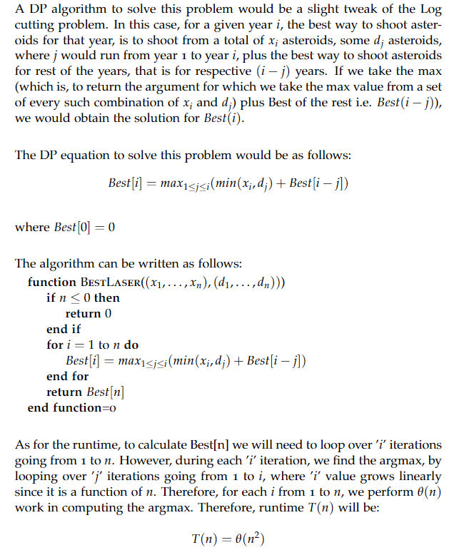

# lasers

## Question
The NASA Near Earth Object Program  lists potential future Earth impact events that the JPL Sentry System has detected based on currently available observations. Sentry is a highly automated collision monitoring system that continually scans the most current asteroid catalog for possibilities of future impact with Earth over the next 100 years. 

This system allows us to predict that $i$ years from now, there will be $x_i$ tons of asteroid material that has near-Earth trajectories.  In the mean time, we can build a space laser that can blast asteroids.  However,  each laser blast will require exajoules of energy, and so there will need to be a recharge period on the order of years between each use of the laser.  The longer the recharge period, the stronger the laser blast; e.g. after $j$ years of charging, the laser will have enough power to obliterate $d_j$ tons of asteroid material.  This problem explores the best way to use such a laser.

Given an array holding $x_i$ and $d_i$, describe an algorithm computes the most amount of asteroid material that can be blasted.  Before presenting the pseudo-code for the algorithm, present a DP equation that characterizes the optimum choice as we have done in class. Analyze the running time of your solution.

## Explanation

## Runtime
O($n^2$)

